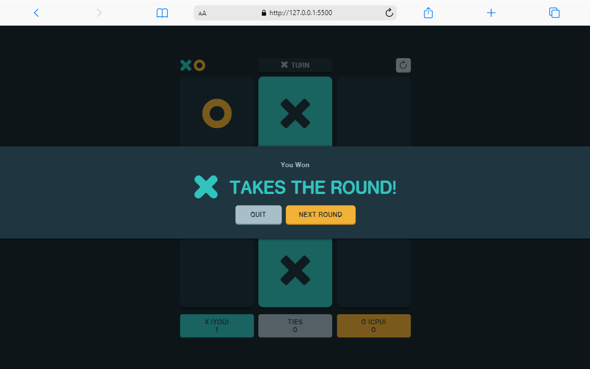
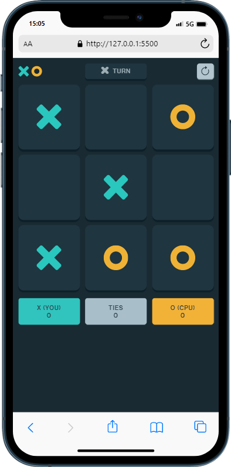

# Jogo da Velha - Tic-Tac-Toe (aleatório)

    
    

Projeto construído utilizando os conceitos básicos de HTML5, CSS3 e JavaScript.

[Clique aqui para acessar a página](https://ericlamounier.github.io/Tic-Tac-Toe/)

## Como jogar
- O jogo funciona de maneira aleatória
- Você será o jogador X, e a máquina o jogador O
- Selecione uma célula para começar o jogo
- Ganha quem conseguir três células consecutivas (horizontal, vertical ou diagonal)

## Tecnologias

- HTML5
- CSS3
- JavaScript

## Contato
eric.botelho@ufv.br

eric_lamounier@outlook.com